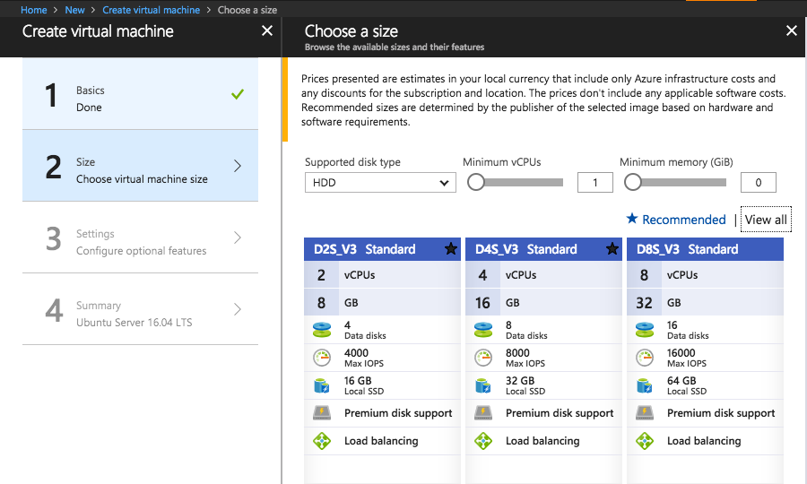

# 微軟Azure雲端平台使用心得

首先很感謝微軟提供這麼多Azure運算資源讓ADLxMLDS課程使用，讓我們能夠有GPU資源來進行作業的模型訓練，解決缺少運算資源的困擾。過去也有一些Azure其他服務的使用經驗，希望一些使用經驗分享，有助於公司產品體驗改善。

## VM使用心得：

* 優點 ：

    * 註冊

        介面清楚，可簡單與原有Microsoft account 連結

    * Dashboard 
    
        GUI介面清楚明瞭，可以即時了解目前有哪些資源正在運作，並可以自由在Resource group 管理、新增所需要的各種資源。

    * 部署方便

        可以按照需求與預算選擇適合的機器使用，並使用助教提供的script進行環境部署，只需要幾行指令，即可完成cuda、cudnn與 CNTK、Tensorflow、pytorch、Keras等深度學習框架的實驗環境的設定，省去許多架設環境的時間成本。

    * 使用彈性

        虛擬機器免除掉續多共用server安裝套件時沒有sudo權限麻煩。比起很多平台只提供jupyter、DIGITS等介面具有更多彈性。並且能夠在Resource group中新增 public ip 讓 tensoerboard、visdom等視覺化的工具能夠在機器上使用。整體適用上體驗很滿意，與自己架設一台獨立的實體機器沒有太大差異。

* 建議：

    * 機器種類選擇多樣，但不太容易找到癥症需要的機器，建議可以在三種filter之外，加上直接搜尋機器的功能。
    
    * 查詢剩餘額度的功能在我們的帳好設定上似乎無法使用，不會隨機器使用減少，直到額度用光，機器直接被停用，可能會造成實驗到一半中斷。
    * 可以再明顯處提供目前所剩餘額度，與估計剩餘時間，讓使用者能夠評估是否需要預先儲值，而不會遇到實驗到一半沒錢的狀況。
    * 因為GPU機器在美國，所以操作的latency稍高，不太可能直接在機器上修改程式，建議可以新增在亞洲的GPU機器。
    * 因為機器只要開著就會繼續算錢，忘記關幾天後額度可能就用光了，希望能有自動偵測的機制，在使用率低的狀況提醒使用者，避免計算資源與用戶金錢的浪費。

## 其餘Azure功能：

* Azure ML Studio

    曾經擔任台灣微軟2017年12/9舉辦之Microsoft Coding Angel助教，協助學員使用Azure ML Studio 從data建立一個predictive model 的web api。
    
    Azure ML studio利用拉線的方式來建立機器學習模型，讓即使沒有程式背景的人，也可以輕鬆入門機器學習的領域，建立自己的預測工具。
    
    另外，由於有多種ML演算法，希望在每個algorithm使用上可以更加人性化，提供簡單的特性說明與tuning教學，而不用每種都要重新google。

    https://github.com/ctwxdd/Azureml-shiny-app

* Azure iot

	以下是使用Azure IOT hub 時所碰到的一些問題與建議；

    * Iot hub free tier 一天8000的 limit希望可以增加
    * AI tool kit for iot edge 的文件可以更加完備
    * Device twin device method 的使用方式希望可以更直觀
    * Stream Analytics delay希望可以縮小一點 document可以著重sliding windows的部分
    * IoT suite remote monitoring 新版在physical device的部分希望可以新增devkit 的template上去

* Azure Cognitive Service 
    * Face API :

        曾經在makeNTU中使用Azure FaceAPI 來製作智慧藥盒，因應現代人有時用各種維他命、葉黃素等補給品的席家，利用辨識人臉讓藥盒能夠自動給予相對應的補給品或藥品。

        https://github.com/BHChoEE/MakeNTU2017_MedCube

    * Computer Vision APi:
    
        曾在Information retireval 之final project 使用 Computer Vision API 來做影像的caption生成，透過簡單的api，就可以省掉要自己train model的麻煩，cognitivie service 對於demo idea或是 prototyping 確實為一個牆而又立的工具。

整體而言，Azure 雲端平台為用戶提供了許多強大的功能，解決了過去大家要自己添購、維護機器的麻煩，架設伺服器只要動動手指，以後就只要跟電信、水電一樣付費即可。雖然未使用過AWS、Google等其他平台提供的服務，但過去Azure完整流暢的使用體驗，讓我未來有雲端平台的需求，仍會以Azure作為優先的考量對象。

